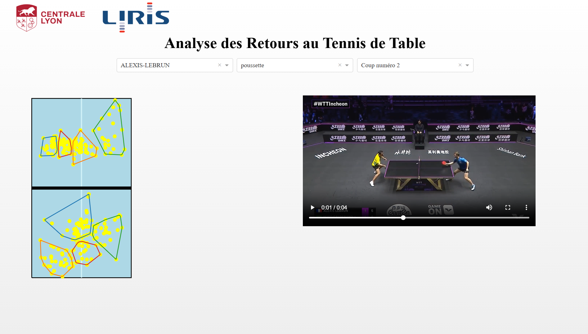
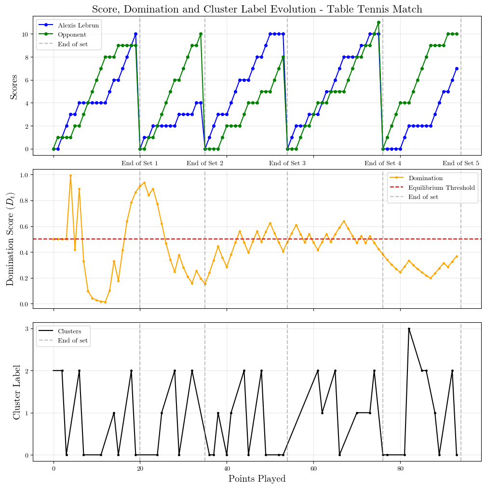
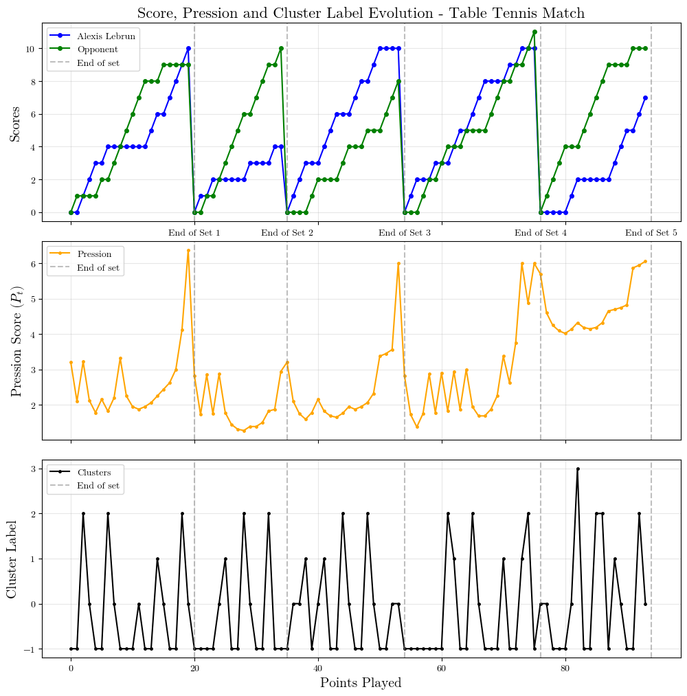

# Analysis of Table Tennis Service Returns

## Project Overview

This project aims to analyze table tennis match data, focusing on **service returns**. The goal is to group these returns into **clusters** using machine learning methods, then interpret these groupings to better understand player strategies and behaviors depending on the type of serve received.

The analysis is based on a database provided by LIRIS, containing in particular:

- The coordinates of bounces,
- The hitting positions,
- The clusters of bounces,
- And many other details from numerous professional matches.

---

## Main Features

### 1. Data Display and Exploration

- **Notebook `1_display_data.ipynb`**  
  Visual exploration of table tennis match data:
    - Interactive and static visualization of bounces and shots on the table,
    - Display of isolated point videos,
    - Exploration of bounce clusters,
    - Use of Plotly figures for analyzing positions and trajectories.

### 2. Calculation and Display of Domination and Pressure Indicators

- **Notebook `2_domination_pression.ipynb`**  
  Calculation and visualization of two advanced metrics:
    - **Domination**: a dynamic indicator taking into account the score, set difference, winner of the previous point, and match evolution,
    - **Pressure**: an indicator measuring the pressure felt at each point (score gap, key moments, end of set, decisive set),
    - Graphical display of the evolution of these indicators throughout the match.

### 3. Analysis of Return Shot Types Distribution

- **Notebook `3_return_type_analysis.ipynb`**  
  Statistical analysis of service return styles:
    - Distribution of different return types (topspin, flip, push shot, block) by player,
    - Visual representation using stacked horizontal bars,
    - Ranking of players based on their offensive return tendency (topspin rate),
    - Comparative analysis of playing styles and tactical preferences in service returns.

---

## Dash Application

A Dash application has been developed to facilitate data exploration.  
Bounces are displayed on a Plotly figure:

- Clicking on a point displays the video of the corresponding rally,
- Several filters allow you to select a player, handedness, or shot number.

<p align="center">
   
</p>

---

## Advanced Analysis: Domination and Pressure

### Domination Indicator

An advanced indicator has been developed to quantify **domination** during a match, taking into account:

- The score,
- The set difference,
- The winner of the previous point,
- The dynamic evolution of the match.

<p align="center">
  
</p>

### Pressure Indicator

Another indicator measures the **pressure** felt by a player at each point, combining:

- The score gap,
- Key moments (set point, match point),
- End of set,
- Decisive set.

<p align="center">
  
</p>

---

## Installation

1. Clone this GitHub repository:

   ```bash
   git clone https://github.com/centralelyon/table-tennis-returns
   cd table-tennis-returns
   ```

2. Install LaTeX dependencies (required for figures):

   - Windows:
     - Install [MiKTeX](https://miktex.org/download)
   - Linux (Ubuntu/Debian):

     ```bash
     sudo apt-get install texlive texlive-latex-extra dvipng
     ```

   - macOS:

     ```bash
     brew install texlive dvipng
     ```

3. Install Python dependencies:

   ```bash
   pip install -r requirements.txt
   ```

---

## Authors

- Riad ATTOU : <attou.rd@gmail.com>
- Marin MATHE : <mathe.marin22@gmail.com>
- Aymeric ERADES : <aymeric.erades@ec-lyon.fr>
- Romain VUILLEMOT : <romain.vuillemot@gmail.com>
